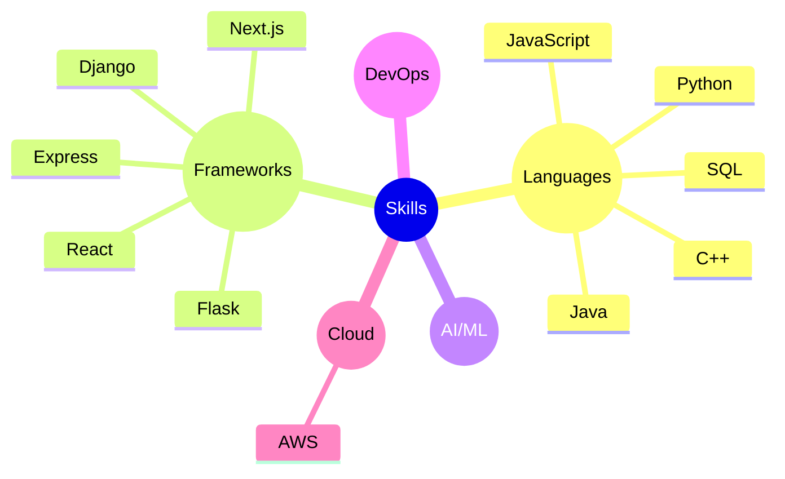

<h3 align="center">👋 Hi there, I'm Jericho Faderon</h3>

  <a href="https://www.linkedin.com/in/jerichofaderon/">LinkedIn</a>

---
I'm a software engineer and product manager with a passion for building accessible websites and fostering inclusive developer communities.

My philosophy is simple: share what I know, stay curious, and create space for others to grow. I enjoy making technical concepts approachable—whether through blog posts, videos, talks, or open source contributions.

Outside of tech, I enjoy photography, watching anime, and perfecting the art of baking brownies 🔥

---

### Tech Snapshot

---

Thanks for visiting!✨ Let's build something awesome together.
